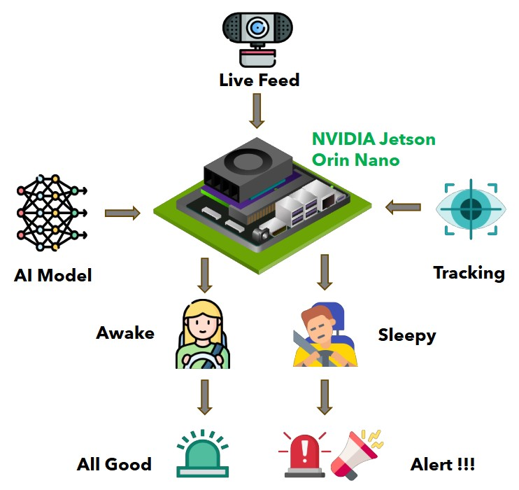
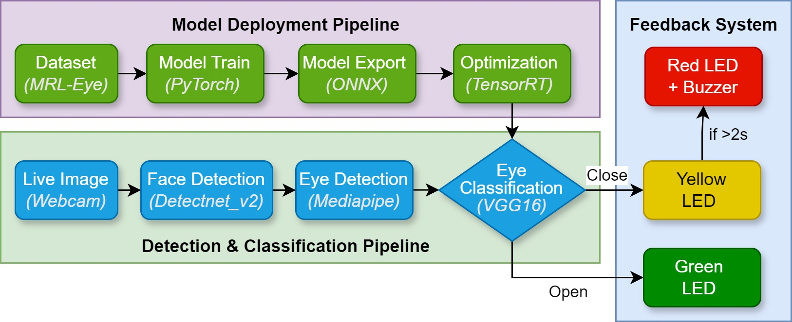

# Drowsiness Detection System in Real-Time Using Edge Computing for Enhanced Driver Safety

## Overview

This project aims to develop a real-time drowsiness detection system for drivers, utilizing NVIDIA's Jetson Orin Nano and edge computing technology. By leveraging deep learning and edge processing, this system provides timely alerts to prevent accidents caused by driver fatigue, with a focus on privacy and low-latency processing.

## Authors
- **Akash Bappy**: [akash.bappy@student.oulu.fi](mailto:akash.bappy@student.oulu.fi)  
- **Mitun Kanti Paul**: [mitunkantipaul.sec@gmai.com](mailto:mitunkantipaul.sec@gmail.com) 
- **Ullash Chouwdhury**: [ullash.chowdhury@student.oulu.fi](mailto:ullash.chowdhury@student.oulu.fi)

## Features

- **Real-Time Drowsiness Detection**: Detects eye closure states using the VGG16 model on the Jetson Orin Nano for immediate response.
- **Edge Computing for Privacy and Reliability**: Local data processing ensures privacy and eliminates cloud dependency, making the system suitable for remote or low-connectivity environments.
- **Escalating Feedback Mechanism**: Alerts are given through LEDs and a buzzer based on eye closure duration to prevent drowsy driving.

## System Components

- **NVIDIA Jetson Orin Nano**: Processes video in real-time, optimized with TensorRT for enhanced performance on edge devices.
- **VGG16 Deep Learning Model**: Achieves 99% accuracy in classifying eye states, optimized for real-time application.
- **Feedback System**: Uses LEDs and a buzzer to alert the driver based on drowsiness levels.
- **Face and Eye Detection**: Utilizes DetectNet v2 and MediaPipe Iris for accurate facial and eye landmark detection under various conditions.

## Methodology

1. **Data Collection**: Utilizes the MRL Infrared Eye Dataset, with images categorized as "Open-Eyes" and "Close-Eyes" to train the model.
2. **Model Training**: VGG16 model trained on PyTorch, optimized and exported to ONNX for compatibility with TensorRT.
3. **Model Optimization**: TensorRT optimizations, including precision reduction (FP32 to FP16) and layer fusion, ensure efficient performance on the Jetson platform.
4. **Pipeline**: 
   - **Face Detection**: Detects driver’s face in each frame.
   - **Eye Detection**: Identifies eye regions for classification.
   - **Eye State Classification**: Determines eye state as open or closed.
5. **Feedback System**: Provides escalating alerts with LEDs and a buzzer based on continuous eye state monitoring.

## Performance

- **Accuracy**: Achieves 99% accuracy with high precision, recall, and F1-scores.
- **Latency**: Averages 14.4 ms per frame, providing smooth real-time performance.
- **FPS**: Optimized with TensorRT to reach 70 FPS on the Jetson Orin Nano.

## Limitations

- **Low-Light Performance**: Reduced accuracy in low-light conditions; can be improved with IR sensors.
- **Driver Identification**: Detects only the largest face; future versions may include driver-specific tracking.

## Future Improvements

- **Eye Pattern Analysis**: Advanced blink and saccade analysis for early drowsiness signs.
- **Pose Estimation**: Detects fatigue indicators like head tilt and posture.
- **System Expansion**: Integration with in-vehicle safety systems for automatic interventions (e.g., speed reduction).
- **Enhanced Model Performance**: Training with a diverse dataset to improve accuracy across various conditions.

## Contact

For more information, please contact:
- **Akash Bappy**: [akash.bappy@student.oulu.fi](mailto:akash.bappy@student.oulu.fi)
- **University of Oulu, Finland**

